Churn Prediction with MlFlow

1.Selecting a Dataset 
 
 
 
Customer churn refers to the phenomenon where customers discontinue 
their relationship or subscription with a company or service provider. It represents 
the rate at which customers stop using a company's products or services within a 
specific period. Churn is an important metric for businesses as it directly impacts 
revenue, growth, and customer retention. 
In the context of the Churn dataset, the churn label indicates whether a customer 
has churned or not. A churned customer is one who has decided to discontinue 
their subscription or usage of the company's services. On the other hand, a non-
churned customer is one who continues to remain engaged and retains their 
relationship with the company. 
Understanding customer churn is crucial for businesses to identify patterns, 
factors, and indicators that contribute to customer attrition. By analyzing churn 
behavior and its associated features, companies can develop strategies to retain 
existing customers, improve customer satisfaction, and reduce customer turnover. 
Predictive modeling techniques can also be applied to forecast and proactively 
address potential churn, enabling companies to take proactive measures to retain 
at-risk customers.

2.Pre-processing the Dataset 

 
Pre-processing data is a crucial step for training a model. The pre-processing 
techniques used for this dataset are: 
1. Column Cleaning: Dropping CustomerID and renaming 
columns to lowercase with underscores for consistency. 
2. Missing Value Handling: Dropping rows with any missing 
values (dropna()). 
3. Type Conversion: Casting discrete numerical features (e.g. 
age, tenure) to int. 
4. Stratified Splitting: Using train_test_split(..., stratify=y) to 
maintain class distribution across training, validation, and test 
sets. 
5. One-Hot Encoding: Converting categorical variables (gender, 
subscription_type, contract_length) into numerical format using 
OneHotEncoder. 
6. Feature Scaling: Standardizing features using StandardScaler.

 
7. Dimensionality Reduction: Applying PCA with n_components 
loaded from a best_pca_components.pkl file to reduce feature 
dimensions while retaining variance. 
 
 
 
 
 
3.Setting up MLFlow 
 
This script is designed to start a local MLflow tracking server, which is used 
for logging and visualizing machine learning experiments. It begins by defining 
and creating a set of directories to store MLflow-related data: a backend store for 
experiment metadata (using a local SQLite database), and an artifact store to save 
models, metrics, and other outputs. These directories are automatically created if 
they don't already exist, ensuring that the environment is always ready for use.  
 
 
 
 
Once the necessary paths are set up, the script constructs a command to launch 
the MLflow server using the configured backend and artifact locations. The 
server is then started on `http://127.0.0.1:5000`, making it accessible via a local 
web browser. This script is especially useful for users who want a reproducible 
and portable way to manage experiment tracking in local or development 
environments. It also includes error handling for common issues like missing 
dependencies, incorrect configurations, or port conflicts. Overall, it simplifies the 
process of running MLflow and ensures that all required components are properly 
initialized.

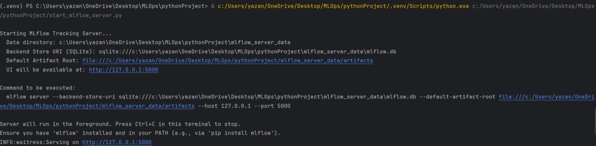

 
 
Figure 1: MLFlow on LocalHost 
 
 
 
4.Model Development and Tracking 
 
As part of this project, I am developing and evaluating several machine 
learning models to predict customer churn using a structured dataset. The pipeline 
begins with extensive preprocessing steps including handling missing values, 
encoding categorical variables with one-hot encoding, scaling numerical features 
with StandardScaler, and reducing dimensionality using Principal Component 
Analysis (PCA). The dataset is then split into stratified training, validation, and 
test sets to maintain the class distribution across all subsets, ensuring reliable 
performance assessment. After preparation, I train models using popular ML 
libraries such as Scikit-learn’s RandomForestClassifier, LightGBM, and 
XGBoost, each offering distinct strengths in handling structured tabular data. 
To ensure that the experimentation process is efficient, reproducible, and well-
documented, I use MLflow for tracking all model development efforts. MLflow 
captures key elements of each training run, including model parameters, 
performance metrics (accuracy, precision, recall, and F1 score), and the trained 
model artifacts themselves. This not only helps in comparing model performance 
across various configurations but also provides a centralized interface to monitor 
and manage experiments through the MLflow UI. Each run is logged under a 
designated experiment, making it easy to revisit, audit, and deploy models that 
meet desired performance criteria.

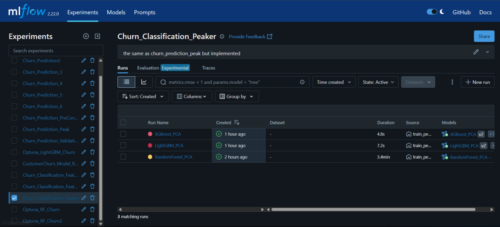

 
By integrating model training with MLflow tracking, the workflow becomes 
highly modular and scalable. It supports iterative improvements and 
experimentation without losing track of past results. This structure is ideal for 
MLOps practices, facilitating collaboration among teams and streamlining the 
transition from model development to production. In essence, the work not only 
focuses on building accurate predictive models but also emphasizes 
maintainability, transparency, and robust version control throughout the machine 
learning lifecycle. In Figure 3, the scores of XGBoost, LightGBM, and 
RandomForest respectively can be found. In Figure 4, a scatter plot of the metrics 
is visualized. It can be observed that RandomForest was the most efficient model.  
 
Figure 2: Metrics of Models 
 
 
Figure 3: Scatter Plot of Models' Performances 
 
5.Tuning Hyperparameters 
 
Since my best performing model was the RandomForestClassifier, I chose to 
tune its hyperparameters. I used the OpTuna library to do so. The Optuna 
library was used to define a search space for key Random Forest 
hyperparameters such as n_estimators, max_depth, min_samples_split, 
min_samples_leaf, and max_features. The optimization objective was to 
maximize recall, which is crucial in churn prediction where identifying every 
customer at risk of leaving is a high priority. For each trial, the model was

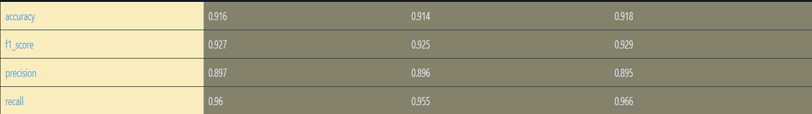

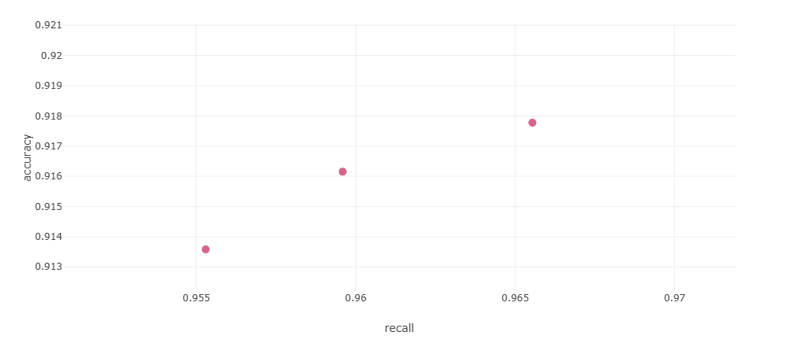

 
trained and evaluated on the validation set, and metrics including recall, 
precision, f1-score, and accuracy were logged to MLflow for experiment 
tracking. This setup allowed me to visualize model performance across trials 
in MLflow and identify the best-performing hyperparameter configuration 
efficiently. In figure 5, you can observe the numerous trials I ran. The best one 
being the one that is pinned named orderly-crane-364, the 25th trial. 
 
 
Figure 4: Trials of Finetuning of RandomForest 
 
By integrating Optuna with MLflow, I was able to automate the tuning process 
and maintain a full experiment history with minimal manual intervention. 
Each trial's parameters and evaluation metrics were logged, and the resulting 
model was versioned and stored in the MLflow registry. This robust pipeline 
facilitates reproducibility, model comparison, and deployment readiness in a 
streamlined and trackable manner. In figure 6, the results of orderly-crane-364 
can be seen. It achieved the highest recall, precision, accuracy, and f1 score. 
The parameters are also listed in figure 6.

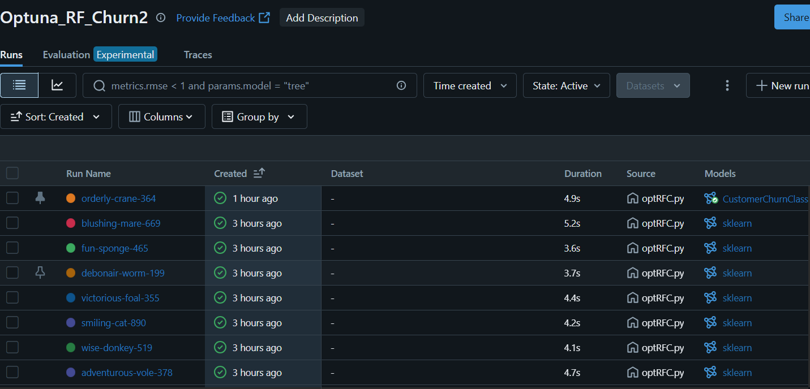

 
 
Figure 5: Results of Trial #25 
 
6.Registering the Model 
 
Since I had optimized RandomForest model, I proceeded to serve it in the 
model registry.  
 
Figure 6: The Optimal RandomForest Model in the Model Registry 
 
I referenced the unique run ID that corresponded to the optimal model identified 
in the tuning phase. This allowed me to locate the logged model artifact stored in 
the run’s artifact path (in this case, under "model"). The model was then 
registered 
in 
the 
MLflow 
Model 
Registry 
under 
the 
name 
"CustomerChurnClassifier_RFC". This process created a new version entry for 
the model within the registry, enabling me to track changes and performance

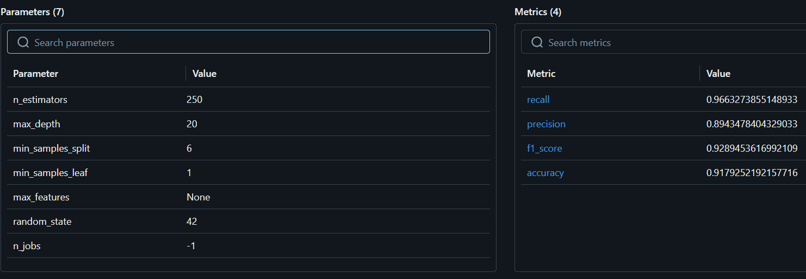

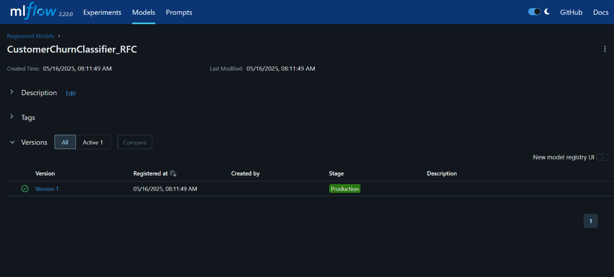

 
improvements across model iterations. The model was then set to the 
“Production” stage in order to deploy it on my API. 
 
 
 
7.Deploying the Model on the API 
 
To deploy the optimized RandomForestClassifier to an interactive Gradio 
API, I first retrieved the model from the MLflow Model Registry. By 
configuring the MLflow tracking URI and specifying the registered model 
name and stage, I was able to load the production-ready model directly into 
the deployment script using mlflow\.sklearn.load\_model. This ensured that 
the model being served is the most accurate and validated version available. 
In addition to the model, the deployment process required loading the same 
preprocessing objects used during training: the one-hot encoder, standard 
scaler, and PCA transformer. These components were stored as pickle files 
during model development and were loaded at runtime to ensure consistent 
transformation of user input data. This step is critical because the model 
expects input that has been encoded, scaled, and reduced using PCA exactly 
as it was during training. 
 
 
Figure 7: Stored Pickle Files 
 
The Gradio interface wraps the prediction logic in a user-friendly web 
application. A function called prepare\_input takes raw input values from the

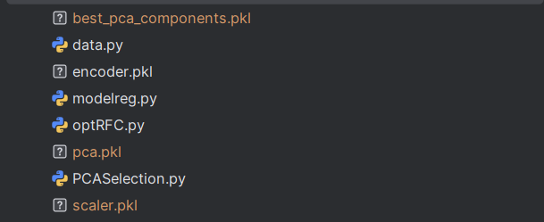

 
user, validates them, and transforms them into the PCA-reduced feature vector 
needed for prediction. The prediction function then uses the loaded 
RandomForest model to compute the probability of churn, and formats the 
result into an interpretable string that shows the likelihood and confidence of 
the prediction. In figure 9, you could observe the interface. Notice how some 
prompts are outlined in red. That is because I implemented constraints on 
those specific inputs just to make logical sense (and not to throw the model 
off-guard). 
 
Figure 8: API Interface 
Finally, Gradio is used to launch the web app with labeled input fields 
corresponding to each of the model's required features. The interface includes 
user guidance such as minimum values and input descriptions, enhancing 
usability for non-technical users. Once launched, the app serves as a 
lightweight but powerful API for real-time churn prediction, effectively 
bringing the optimized machine learning model into a production 
environment.

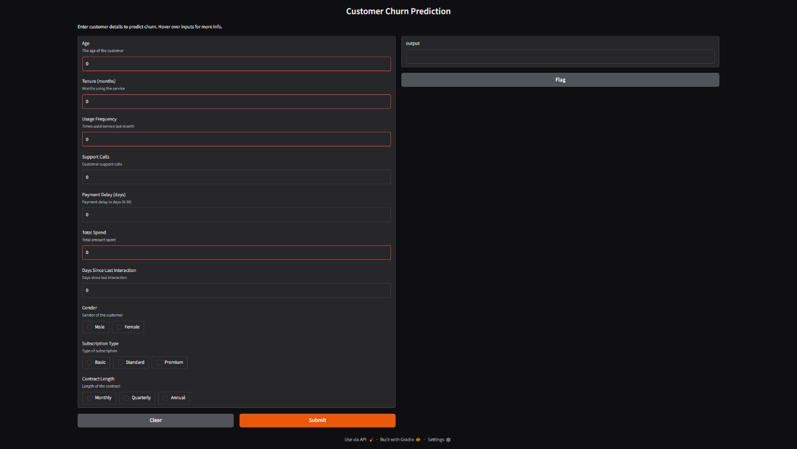

 
 
Figure 9: A Successful Prediction 
 
 
8.Feature Correlation 
 
Figure 11 presents a correlation heatmap illustrating the relationship 
between various independent features and customer churn. The color intensity 
and correlation values offer insight into how significantly each numerical variable 
influences churn. Notably, support_calls shows the strongest positive correlation 
(0.52), indicating that customers who reach out more frequently to customer 
support are more likely to churn. Similarly, payment_delay (0.33) and age (0.19) 
also show positive correlations with churn, suggesting that customers with 
delayed payments or older age profiles may be at increased risk. On the other 
hand, total_spend exhibits a notable negative correlation (-0.37), implying that 
higher-spending customers are less likely to churn. 
 
It is important to mention that certain features such as gender, subscription_type, 
and contract_length are absent from this heatmap because they are categorical 
and were one-hot encoded, making simple correlation analysis less 
straightforward. Additionally, their individual encoded components did not 
demonstrate a strong influence on churn in earlier exploratory analyses, hence 
they were not included in this figure. The heatmap emphasizes that the magnitude

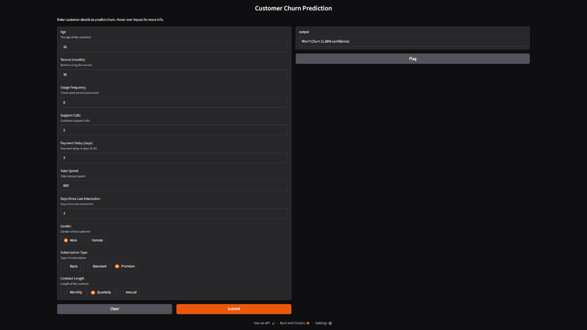

 
of the correlation coefficient serves as an indicator of a feature’s impact on churn 
prediction: the higher the absolute value, the more influential the feature is on 
determining churn likelihood. 
 
 
Figure 10: Correlation Heatmap between Independent Features and Churn 
 
9.Conclusion  
 
In conclusion, this project successfully developed and deployed a robust 
machine learning pipeline for predicting customer churn using structured data and 
modern MLOps practices. From the initial data preprocessing steps—including 
encoding, scaling, and dimensionality reduction—to model training and 
hyperparameter tuning, every component was designed with accuracy, 
reproducibility, and production-readiness in mind. Among several candidate 
models, RandomForestClassifier emerged as the best performer, particularly after 
fine-tuning with the Optuna optimization framework. By focusing on recall as the 
key metric, the project prioritized the identification of potential churners, which 
is critical for proactive retention strategies. 
 
Beyond model development, the integration of MLflow throughout the workflow 
provided end-to-end experiment tracking, parameter logging, and artifact 
management. The best-performing model was registered in the MLflow Model 
Registry and transitioned to the Production stage, streamlining its accessibility 
and deployment. A lightweight, user-friendly API was then created using Gradio,

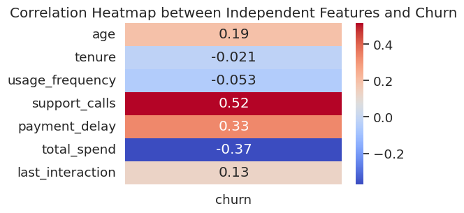

 
allowing real-time churn predictions through an interactive interface. The 
deployment pipeline also ensured that all preprocessing steps—such as encoding 
and PCA transformation—were consistently applied at inference time, preserving 
model integrity. 
 
This project not only demonstrated the technical implementation of a churn 
prediction system but also highlighted the operational tools necessary for scalable 
and maintainable machine learning solutions. By adhering to MLOps principles, 
it provided a structured foundation for future enhancements, including continuous 
model monitoring, retraining, and integration with larger customer relationship 
platforms. Ultimately, the work offers a practical and production-grade approach 
to identifying at-risk customers and enabling data-driven retention efforts

 

